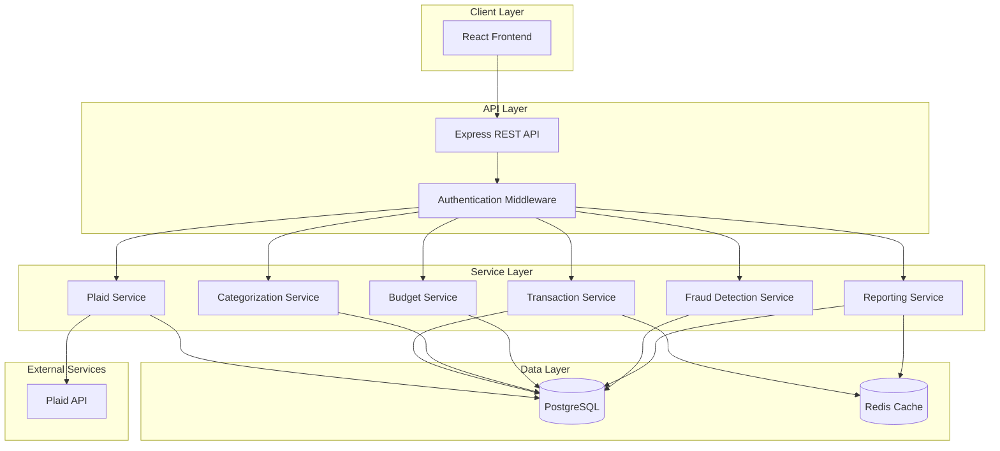

# Budget App Design Document

## Overview

The Budget App is a full-stack personal finance management application that leverages Plaid's API for secure bank integration. The system follows a layered architecture with a React frontend, Node.js/Express backend, and PostgreSQL database. The application emphasizes security, real-time data synchronization, and intelligent transaction categorization using machine learning techniques.

## Architecture

### High-Level Architecture



### Technology Stack

**Frontend:**
- React 18 with TypeScript
- React Router for navigation
- TanStack Query for data fetching and caching
- Tailwind CSS for styling
- Recharts for data visualization

**Backend:**
- Node.js with Express
- TypeScript
- JWT for authentication
- Plaid Node SDK

**Database:**
- PostgreSQL for persistent storage
- Redis for caching and session management

**Security:**
- bcrypt for password hashing
- crypto module for AES-256 encryption
- Helmet.js for HTTP security headers
- Rate limiting with express-rate-limit

## Components and Interfaces

### Frontend Components

#### 1. Authentication Module
- **LoginPage**: User login interface
- **RegisterPage**: New user registration
- **AuthContext**: Global authentication state management

#### 2. Account Management Module
- **AccountLinkButton**: Initiates Plaid Link flow
- **AccountList**: Displays connected accounts
- **AccountCard**: Individual account details with balance and last sync time

#### 3. Transaction Module
- **TransactionList**: Paginated transaction display with filtering
- **TransactionDetail**: Detailed view with categorization options
- **TransactionFilters**: Filter by date, category, amount, account

#### 4. Budget Module
- **BudgetDashboard**: Overview of all budget plans with progress bars
- **BudgetForm**: Create/edit budget plans
- **BudgetProgress**: Visual representation of spending vs. budget

#### 5. Fraud Detection Module
- **FraudAlertList**: Display of flagged transactions
- **FraudAlertCard**: Individual alert with action buttons (confirm/dismiss)

#### 6. Reporting Module
- **SpendingChart**: Category breakdown with pie/bar charts
- **TrendAnalysis**: Time-series spending trends
- **ReportExport**: CSV export functionality

### Backend API Endpoints

#### Authentication
```
POST /api/auth/register - Create new user account
POST /api/auth/login - Authenticate user
POST /api/auth/logout - Invalidate session
GET /api/auth/me - Get current user info
```

#### Plaid Integration
```
POST /api/plaid/create-link-token - Generate Plaid Link token
POST /api/plaid/exchange-token - Exchange public token for access token
GET /api/plaid/accounts - Get linked accounts
DELETE /api/plaid/accounts/:id - Unlink account
POST /api/plaid/sync - Manually trigger transaction sync
```

#### Transactions
```
GET /api/transactions - Get transactions with pagination and filters
GET /api/transactions/:id - Get single transaction
PATCH /api/transactions/:id/category - Update transaction category
POST /api/transactions/sync - Sync transactions from Plaid
```

#### Budgets
```
GET /api/budgets - Get all budget plans
POST /api/budgets - Create budget plan
PUT /api/budgets/:id - Update budget plan
DELETE /api/budgets/:id - Delete budget plan
GET /api/budgets/:id/progress - Get budget spending progress
```

#### Fraud Detection
```
GET /api/fraud/alerts - Get fraud alerts
PATCH /api/fraud/alerts/:id - Mark alert as reviewed/false positive
GET /api/fraud/settings - Get fraud detection settings
PUT /api/fraud/settings - Update fraud detection thresholds
```

#### Reports
```
GET /api/reports/spending - Get spending by category
GET /api/reports/trends - Get spending trends over time
GET /api/reports/export - Export data as CSV
```

## Data Models

### User
```typescript
interface User {
  id: string;
  email: string;
  passwordHash: string;
  firstName: string;
  lastName: string;
  createdAt: Date;
  updatedAt: Date;
}
```

### PlaidAccount
```typescript
interface PlaidAccount {
  id: string;
  userId: string;
  plaidAccountId: string;
  plaidAccessToken: string; // Encrypted
  accountName: string;
  accountType: 'depository' | 'credit' | 'loan' | 'investment';
  accountSubtype: string;
  currentBalance: number;
  availableBalance: number;
  lastSyncedAt: Date;
  isActive: boolean;
  createdAt: Date;
}
```

### Transaction
```typescript
interface Transaction {
  id: string;
  userId: string;
  accountId: string;
  plaidTransactionId: string;
  amount: number;
  date: Date;
  merchantName: string;
  description: string;
  categoryId: string;
  categoryConfidence: number; // 0-100
  isPending: boolean;
  location: {
    city: string;
    region: string;
    country: string;
  };
  isFraudulent: boolean;
  createdAt: Date;
  updatedAt: Date;
}
```

### Category
```typescript
interface Category {
  id: string;
  name: string;
  icon: string;
  color: string;
  parentCategoryId: string | null;
  isSystem: boolean; // System vs. user-created
}
```

### Budget
```typescript
interface Budget {
  id: string;
  userId: string;
  categoryId: string;
  amount: number;
  period: 'monthly' | 'quarterly' | 'annual';
  startDate: Date;
  endDate: Date;
  alertThreshold: number; // Percentage (default 80)
  isActive: boolean;
  createdAt: Date;
  updatedAt: Date;
}
```

### FraudAlert
```typescript
interface FraudAlert {
  id: string;
  userId: string;
  transactionId: string;
  alertType: 'unusual_amount' | 'unusual_location' | 'rapid_transactions';
  severity: 'low' | 'medium' | 'high';
  reason: string;
  isReviewed: boolean;
  isFalsePositive: boolean;
  reviewedAt: Date | null;
  createdAt: Date;
}
```

### CategorizationRule
```typescript
interface CategorizationRule {
  id: string;
  userId: string;
  merchantPattern: string; // Regex pattern
  categoryId: string;
  priority: number;
  learnedFromUser: boolean;
  createdAt: Date;
}
```

## Service Layer Details

### Plaid Service
**Responsibilities:**
- Manage Plaid Link token generation
- Exchange public tokens for access tokens
- Fetch account information
- Sync transactions from Plaid
- Handle Plaid webhooks for real-time updates

**Key Methods:**
- `createLinkToken(userId: string): Promise<string>`
- `exchangePublicToken(publicToken: string, userId: string): Promise<void>`
- `syncTransactions(accountId: string): Promise<Transaction[]>`
- `getAccounts(userId: string): Promise<PlaidAccount[]>`
- `removeAccount(accountId: string): Promise<void>`

### Transaction Service
**Responsibilities:**
- Store and retrieve transactions
- Deduplicate transactions
- Coordinate with categorization service
- Trigger fraud detection on new transactions

**Key Methods:**
- `importTransactions(transactions: PlaidTransaction[], accountId: string): Promise<void>`
- `getTransactions(userId: string, filters: TransactionFilters): Promise<Transaction[]>`
- `updateCategory(transactionId: string, categoryId: string): Promise<void>`
- `detectDuplicates(transaction: Transaction): Promise<boolean>`

### Categorization Service
**Responsibilities:**
- Auto-categorize transactions using rules and ML
- Learn from user corrections
- Manage categorization rules

**Key Methods:**
- `categorizeTransaction(transaction: Transaction): Promise<{categoryId: string, confidence: number}>`
- `learnFromCorrection(transactionId: string, newCategoryId: string): Promise<void>`
- `getCategories(): Promise<Category[]>`

**Categorization Logic:**
1. Check user-specific learned rules (highest priority)
2. Check merchant name patterns
3. Use Plaid's category suggestions
4. Apply default category with low confidence

### Budget Service
**Responsibilities:**
- Manage budget plans
- Calculate spending progress
- Send budget alerts

**Key Methods:**
- `createBudget(budget: Budget): Promise<Budget>`
- `getBudgetProgress(budgetId: string): Promise<BudgetProgress>`
- `checkBudgetAlerts(userId: string): Promise<void>`
- `calculateSpending(budgetId: string): Promise<number>`

### Fraud Detection Service
**Responsibilities:**
- Analyze transactions for fraud patterns
- Generate fraud alerts
- Learn from false positives

**Key Methods:**
- `analyzeTransaction(transaction: Transaction): Promise<FraudAlert[]>`
- `checkUnusualAmount(transaction: Transaction): Promise<boolean>`
- `checkUnusualLocation(transaction: Transaction): Promise<boolean>`
- `checkRapidTransactions(userId: string, transaction: Transaction): Promise<boolean>`
- `markFalsePositive(alertId: string): Promise<void>`

**Fraud Detection Rules:**
- **Unusual Amount**: Transaction > 3x rolling 30-day average
- **Unusual Location**: Transaction location differs from user's typical locations (based on historical data)
- **Rapid Transactions**: 3+ transactions within 5 minutes

### Reporting Service
**Responsibilities:**
- Generate spending reports
- Calculate trends and analytics
- Export data

**Key Methods:**
- `getSpendingByCategory(userId: string, dateRange: DateRange): Promise<SpendingReport>`
- `getTrends(userId: string, period: string): Promise<TrendData>`
- `exportTransactions(userId: string, format: 'csv'): Promise<Buffer>`

## Error Handling

### Error Types
```typescript
class AppError extends Error {
  statusCode: number;
  isOperational: boolean;
}

class PlaidError extends AppError {
  plaidErrorCode: string;
}

class ValidationError extends AppError {}
class AuthenticationError extends AppError {}
class NotFoundError extends AppError {}
```

### Error Handling Strategy

1. **API Layer**: Express error middleware catches all errors
2. **Service Layer**: Throws typed errors with context
3. **Client Layer**: Display user-friendly error messages
4. **Logging**: All errors logged with context (user ID, request ID, timestamp)

### Retry Logic
- Plaid API failures: Exponential backoff (1s, 2s, 4s)
- Transaction sync failures: Retry after 1 hour
- Database connection issues: Retry 3 times with 5s delay

## Security Implementation

### Data Encryption
- **At Rest**: Plaid access tokens encrypted with AES-256 using application secret key
- **In Transit**: All API communication over HTTPS/TLS 1.3
- **Password Storage**: bcrypt with salt rounds = 12

### Authentication Flow
1. User submits credentials
2. Server validates and generates JWT (expires in 24 hours)
3. JWT stored in httpOnly cookie
4. Refresh token stored separately (expires in 30 days)
5. Session data cached in Redis

### Authorization
- Middleware validates JWT on protected routes
- User ID extracted from token
- All database queries filtered by user ID to prevent data leakage

### Rate Limiting
- Authentication endpoints: 5 requests per 15 minutes per IP
- API endpoints: 100 requests per 15 minutes per user
- Plaid sync: 1 request per minute per account

## Testing Strategy

### Unit Tests
- Service layer methods with mocked dependencies
- Utility functions (encryption, validation)
- Categorization logic
- Fraud detection algorithms
- Target: 80% code coverage

### Integration Tests
- API endpoints with test database
- Plaid service with Plaid Sandbox environment
- Database operations
- Authentication flows

### End-to-End Tests
- Critical user flows:
  - Account linking
  - Transaction sync and categorization
  - Budget creation and alerts
  - Fraud alert handling
- Use Playwright for browser automation

### Performance Tests
- Transaction import with 1000+ transactions
- Report generation with large datasets
- Concurrent user sessions
- Database query optimization

## Deployment Considerations

### Environment Variables
```
DATABASE_URL
REDIS_URL
PLAID_CLIENT_ID
PLAID_SECRET
PLAID_ENV (sandbox/development/production)
JWT_SECRET
ENCRYPTION_KEY
SESSION_SECRET
```

### Database Migrations
- Use a migration tool (e.g., Prisma Migrate or node-pg-migrate)
- Version-controlled migration files
- Automated migrations in CI/CD pipeline

### Monitoring
- Application logs (Winston or Pino)
- Error tracking (Sentry)
- Performance monitoring (New Relic or DataDog)
- Plaid webhook monitoring

### Scalability
- Horizontal scaling of API servers behind load balancer
- Database connection pooling
- Redis for session management and caching
- Background job queue for transaction syncing (Bull or BullMQ)
